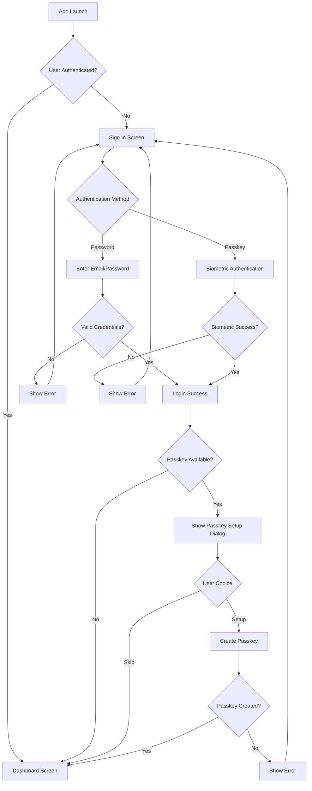
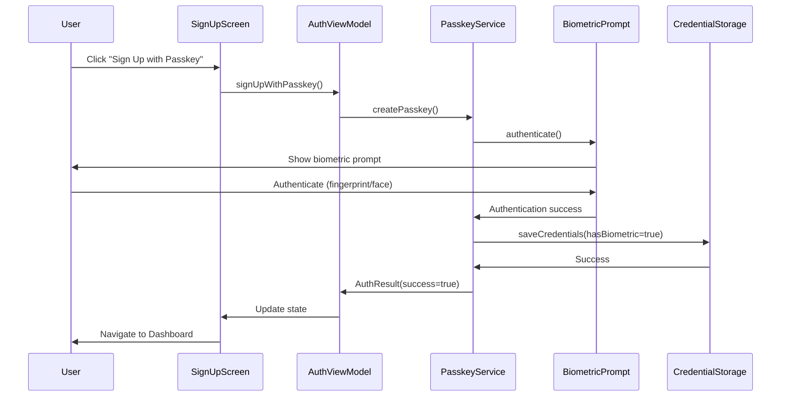
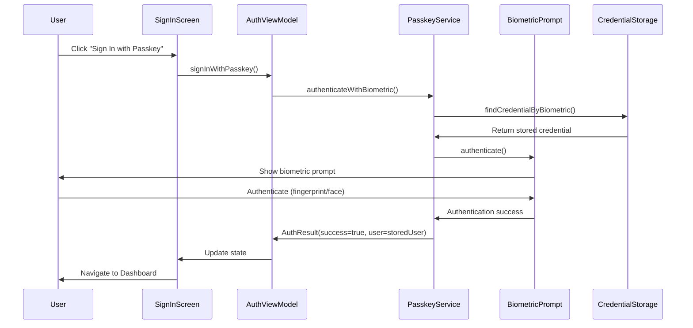

# Building a Modern Android App with Credential Manager and Passkeys

## Table of Contents
1. [Introduction](#introduction)
2. [What is Credential Manager?](#what-is-credential-manager)
3. [What are Passkeys?](#what-are-passkeys)
4. [Project Architecture](#project-architecture)
5. [Implementation Step by Step](#implementation-step-by-step)
6. [Flow Diagrams](#flow-diagrams)
7. [Key Features](#key-features)
8. [Technical Challenges & Solutions](#technical-challenges--solutions)
9. [Screenshots & UI Design](#screenshots--ui-design)
10. [Best Practices](#best-practices)
11. [Conclusion](#conclusion)

---

## Introduction

In this comprehensive guide, we'll explore how to build a modern Android authentication app using **Credential Manager** and **Passkeys**. This implementation demonstrates the future of secure authentication, combining traditional password-based login with cutting-edge biometric authentication.

### What We Built
- A complete authentication system with sign-in/sign-up flows
- Integration with Android's Credential Manager API
- Biometric authentication using Passkeys
- Modern UI built with Jetpack Compose
- MVVM architecture with proper state management
- Post-login Passkey setup dialog

---

## What is Credential Manager?

**Credential Manager** is an Android API that provides a unified interface for managing user credentials across different authentication methods. It acts as a secure bridge between your app and various credential providers.

### Key Benefits:
- **Unified API**: Single interface for passwords, passkeys, and other credentials
- **Security**: Credentials are stored securely by the system
- **User Experience**: Seamless integration with password managers
- **Cross-app**: Works across different apps on the device

### How it Works:
```kotlin
// Example: Getting saved credentials
val credentialManager = CredentialManager.create(context)
val request = GetCredentialRequest.Builder()
    .addCredentialOption(PasswordCredentialOption())
    .build()

val response = credentialManager.getCredential(request)
```

---

## What are Passkeys?

**Passkeys** are a new authentication standard that replaces passwords with cryptographic keys. They use biometric authentication (fingerprint, face unlock) or device PIN/pattern to authenticate users.

### Key Features:
- **Phishing Resistant**: Cannot be phished like passwords
- **No Server Storage**: Private keys never leave the device
- **Biometric Integration**: Uses device's built-in security
- **Cross-Platform**: Works across different devices and platforms

### How Passkeys Work:
1. **Registration**: User creates a passkey linked to their account
2. **Authentication**: User authenticates using biometrics
3. **Verification**: System verifies the cryptographic signature
4. **Access**: User gains access without entering passwords

---

## Project Architecture

Our app follows the **MVVM (Model-View-ViewModel)** pattern with clean separation of concerns:

```
📁 app/src/main/java/com/karishma/credentialmanagersample/
├── 📁 data/
│   ├── User.kt                    # User data model
│   └── AuthState.kt              # Authentication states
├── 📁 credential/
│   ├── CredentialManagerService.kt # Credential management
│   └── CredentialStorage.kt      # Local credential storage
├── 📁 passkey/
│   └── PasskeyService.kt         # Biometric authentication
├── 📁 viewmodel/
│   └── AuthViewModel.kt          # Business logic & state
├── 📁 ui/
│   ├── 📁 screens/
│   │   ├── SignInScreen.kt       # Sign-in UI
│   │   ├── SignUpScreen.kt       # Sign-up UI
│   │   └── DashboardScreen.kt    # Main dashboard
│   ├── 📁 components/
│   │   └── PasskeySetupDialog.kt # Passkey setup dialog
│   └── 📁 theme/
│       ├── Color.kt              # Color definitions
│       ├── Theme.kt              # Material 3 theme
│       └── Type.kt               # Typography
├── 📁 navigation/
│   └── AuthNavigation.kt         # Navigation logic
└── MainActivity.kt               # Main activity
```

---

## Implementation Step by Step

### Step 1: Project Setup & Dependencies

First, we added the necessary dependencies to `build.gradle.kts`:

```kotlin
dependencies {
    // Credential Manager
    implementation(libs.androidx.credentials)
    implementation(libs.androidx.credentials.play.services.auth)
    
    // Navigation
    implementation(libs.androidx.navigation.compose)
    
    // ViewModel
    implementation(libs.androidx.lifecycle.viewmodel.compose)
    
    // Material Icons
    implementation("androidx.compose.material:material-icons-extended")
    
    // Biometric
    implementation(libs.androidx.biometric)
}
```

### Step 2: Data Models

We created the foundational data models:

**User.kt** - Represents a user account:
```kotlin
data class User(
    val id: String,
    val email: String,
    val name: String
)
```

**AuthState.kt** - Manages authentication states:
```kotlin
sealed interface AuthState {
    object Loading : AuthState
    data class Authenticated(val user: User) : AuthState
    object Unauthenticated : AuthState
    data class Error(val message: String) : AuthState
}
```

### Step 3: Credential Storage

**CredentialStorage.kt** - Local storage for demo purposes:
```kotlin
class CredentialStorage(private val context: Context) {
    data class StoredCredential(
        val id: String,
        val email: String,
        val password: String,
        val name: String,
        var hasBiometric: Boolean = false
    )
    
    fun saveCredentials(credential: StoredCredential): Boolean
    fun findCredentialByEmail(email: String): StoredCredential?
    fun findCredentialByBiometric(): StoredCredential?
    fun enableBiometricForCredential(email: String): Boolean
}
```

### Step 4: Credential Manager Service

**CredentialManagerService.kt** - Handles traditional authentication:
```kotlin
class CredentialManagerService(private val context: Context) {
    private val credentialManager = CredentialManager.create(context)
    private val credentialStorage = CredentialStorage(context)
    
    suspend fun signInWithPassword(request: SignInRequest): AuthResult
    suspend fun signUpWithPassword(request: SignUpRequest): AuthResult
    suspend fun getSavedCredentials(): AuthResult
    suspend fun signOut()
}
```

### Step 5: Passkey Service

**PasskeyService.kt** - Handles biometric authentication:
```kotlin
class PasskeyService(private val context: Context) {
    private val biometricManager = BiometricManager.from(context)
    private val credentialStorage = CredentialStorage(context)
    
    fun isBiometricAvailable(): Boolean
    fun getBiometricStatus(): BiometricStatus
    suspend fun authenticateWithBiometric(activity: FragmentActivity): AuthResult
    suspend fun createPasskey(activity: FragmentActivity, email: String, name: String, password: String): AuthResult
}
```

### Step 6: ViewModel

**AuthViewModel.kt** - Manages app state and business logic:
```kotlin
class AuthViewModel(application: Application) : AndroidViewModel(application) {
    private val _authState = MutableStateFlow<AuthState>(AuthState.Loading)
    val authState: StateFlow<AuthState> = _authState.asStateFlow()
    
    private val _biometricStatus = MutableStateFlow(BiometricStatus.UNKNOWN_ERROR)
    val biometricStatus: StateFlow<BiometricStatus> = _biometricStatus.asStateFlow()
    
    private val _showPasskeySetupDialog = MutableStateFlow(false)
    val showPasskeySetupDialog: StateFlow<Boolean> = _showPasskeySetupDialog.asStateFlow()
    
    fun signIn(email: String, password: String)
    fun signUp(email: String, password: String, name: String)
    fun signInWithPasskey(activity: FragmentActivity)
    fun signUpWithPasskey(activity: FragmentActivity, email: String, name: String, password: String)
    fun setupPasskeyForCurrentUser(activity: FragmentActivity)
}
```

### Step 7: UI Screens

**SignInScreen.kt** - Modern sign-in interface with Passkey support:
```kotlin
@Composable
fun SignInScreen(
    onSignIn: (String, String) -> Unit,
    onSignInWithPasskey: () -> Unit,
    onNavigateToSignUp: () -> Unit,
    isLoading: Boolean,
    errorMessage: String?,
    isPasskeyAvailable: Boolean = true
) {
    // Beautiful gradient background
    // Material 3 design components
    // IME action handling for keyboard
    // Passkey integration
}
```

**PasskeySetupDialog.kt** - Post-login Passkey setup:
```kotlin
@Composable
fun PasskeySetupDialog(
    isVisible: Boolean,
    onDismiss: () -> Unit,
    onSetupPasskey: () -> Unit,
    onSkip: () -> Unit,
    userEmail: String
) {
    // Modern dialog design
    // Benefits explanation
    // Call-to-action buttons
}
```

### Step 8: Navigation

**AuthNavigation.kt** - Handles screen navigation:
```kotlin
@Composable
fun AuthNavigation(
    navController: NavHostController,
    onSignIn: (String, String) -> Unit,
    onSignInWithPasskey: () -> Unit,
    onSignUp: (String, String, String) -> Unit,
    onSignUpWithPasskey: (String, String, String) -> Unit,
    onSignOut: () -> Unit,
    isLoading: Boolean,
    errorMessage: String?,
    isAuthenticated: Boolean,
    user: User?,
    isPasskeyAvailable: Boolean
) {
    // Navigation logic between screens
}
```

---

## Flow Diagrams

### Authentication Flow



### Passkey Creation Flow



### Sign-In with Passkey Flow



---

## Key Features

### 1. **Dual Authentication Methods**
- Traditional email/password login
- Modern Passkey authentication
- Seamless switching between methods

### 2. **Modern UI Design**
- Material 3 design system
- Gradient backgrounds
- Smooth animations
- Responsive layout

### 3. **Smart Passkey Integration**
- Automatic Passkey setup suggestion
- Biometric availability detection
- Graceful fallback to passwords

### 4. **Enhanced User Experience**
- IME action handling (Done button closes keyboard)
- Password visibility toggle
- Loading states and error handling
- Intuitive navigation

### 5. **Security Features**
- Secure credential storage
- Biometric authentication
- No plain text password storage
- Proper error handling

---

## Technical Challenges & Solutions

### Challenge 1: Threading Issues with BiometricPrompt

**Problem**: `BiometricPrompt.authenticate()` must be called on the main thread, but we were calling it from background coroutines.

**Solution**: 
```kotlin
// Before (Problematic)
CoroutineScope(Dispatchers.IO).launch {
    biometricPrompt.authenticate(promptInfo) // ❌ Crashes!
}

// After (Fixed)
CoroutineScope(Dispatchers.IO).launch {
    CoroutineScope(Dispatchers.Main).launch {
        biometricPrompt.authenticate(promptInfo) // ✅ Works!
    }
}
```

### Challenge 2: LiveEdit Compatibility

**Problem**: Android Studio's LiveEdit feature couldn't handle anonymous inner classes extending `BiometricPrompt.AuthenticationCallback`.

**Solution**: Extracted callbacks into separate methods:
```kotlin
private fun createBiometricCallback(
    continuation: CancellableContinuation<AuthResult>,
    biometricCredential: StoredCredential
): BiometricPrompt.AuthenticationCallback {
    return object : BiometricPrompt.AuthenticationCallback() {
        // Implementation
    }
}
```

### Challenge 3: State Management

**Problem**: Managing complex authentication states across multiple screens.

**Solution**: Used StateFlow for reactive state management:
```kotlin
private val _authState = MutableStateFlow<AuthState>(AuthState.Loading)
val authState: StateFlow<AuthState> = _authState.asStateFlow()
```

---

## Screenshots & UI Design

### Sign-In Screen
- **Gradient Background**: Modern purple-blue gradient
- **Material 3 Cards**: Elevated sign-in form
- **Dual Authentication**: Password and Passkey options
- **Smart Keyboard**: IME actions for better UX

### Sign-Up Screen
- **Consistent Design**: Matches sign-in screen
- **Form Validation**: Real-time input validation
- **Passkey Integration**: Seamless biometric sign-up

### Passkey Setup Dialog
- **Modern Design**: Rounded corners and elevation
- **Clear Benefits**: Explains Passkey advantages
- **User Choice**: Setup or skip options

### Dashboard Screen
- **Clean Layout**: User information display
- **Sign-Out Option**: Easy account switching
- **Status Indicators**: Authentication method display

---

## Best Practices

### 1. **Security**
- Never store passwords in plain text
- Use secure storage mechanisms
- Implement proper error handling
- Validate all inputs

### 2. **User Experience**
- Provide clear feedback for all actions
- Handle loading states gracefully
- Implement proper keyboard behavior
- Use consistent design patterns

### 3. **Architecture**
- Follow MVVM pattern
- Use dependency injection
- Implement proper state management
- Separate concerns clearly

### 4. **Performance**
- Use appropriate coroutine dispatchers
- Implement proper lifecycle management
- Optimize UI rendering
- Handle memory efficiently

---

## Conclusion

This implementation demonstrates how to build a modern Android authentication app using Credential Manager and Passkeys. The combination of traditional password authentication with cutting-edge biometric authentication provides users with both security and convenience.

### Key Takeaways:

1. **Credential Manager** provides a unified API for managing various authentication methods
2. **Passkeys** offer a more secure and user-friendly alternative to passwords
3. **Jetpack Compose** enables beautiful, modern UI design
4. **MVVM architecture** ensures maintainable and testable code
5. **Proper threading** is crucial for biometric authentication
6. **User experience** should be the primary focus when implementing authentication

### Future Enhancements:

- Integration with real backend services
- Support for multiple credential providers
- Advanced biometric authentication options
- Cross-platform Passkey support
- Enhanced security features

This implementation serves as a solid foundation for building production-ready authentication systems that prioritize both security and user experience.

---

## Resources

- [Android Credential Manager Documentation](https://developer.android.com/training/sign-in/passkeys)
- [Jetpack Compose Documentation](https://developer.android.com/jetpack/compose)
- [Material 3 Design System](https://m3.material.io/)
- [Android Biometric Authentication](https://developer.android.com/training/sign-in/biometric-auth)
- [Passkey Implementation Guide](https://developers.google.com/identity/passkeys)

---

*This article was created as part of a comprehensive Android development tutorial focusing on modern authentication methods and user experience design.*
